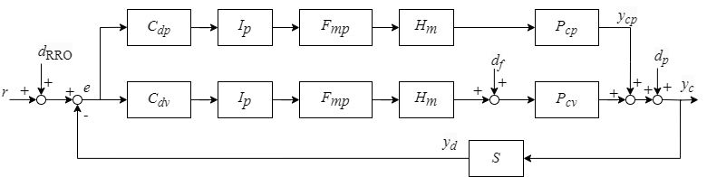
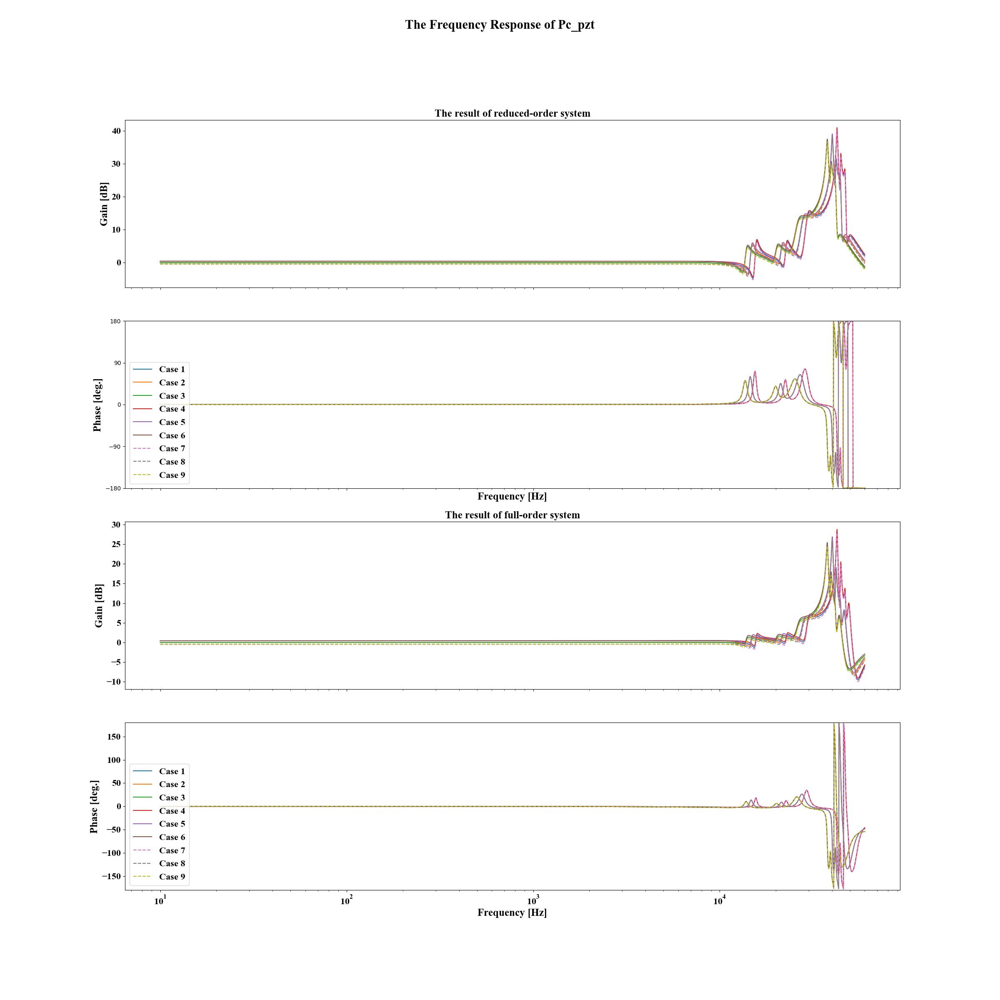
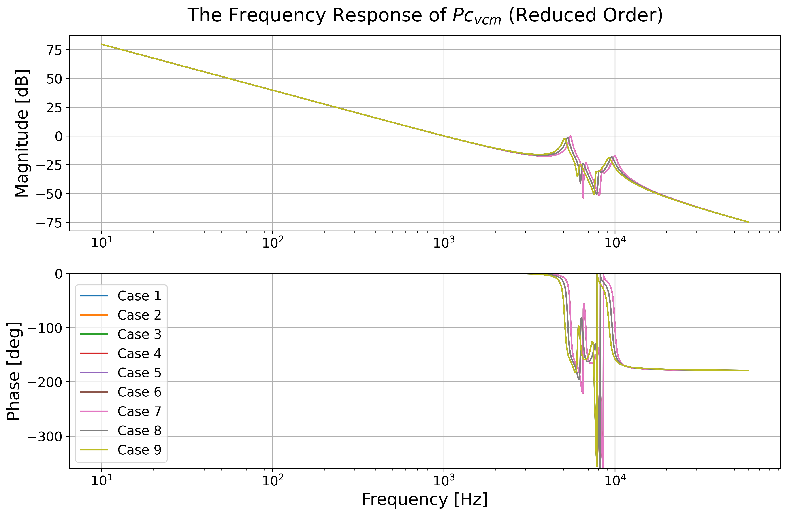
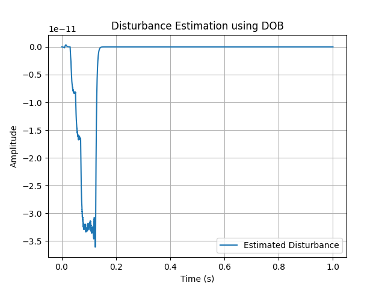

# Summary
The exponential growth in data generation and storage requirements has placed significant demands on hard disk drive (HDD) technology, necessitating continuous improvements in data capacity and access precision. To achieve higher data capacities, improving the positioning accuracy of the magnetic head in HDDs is crucial. Simulation provides a highly efficient method for studying HDD control systems.

This work presents a comprehensive Python-based framework for simulating and analyzing magnetic-head positioning control systems in HDDs, adapted from an established MATLAB implementation. The system includes plants, feedback controllers and multi-rate filters for voice coil motors (VCMs) and  piezoelectric (PZT) actuators, while considering various disturbances caused by repeatable run-out (RRO), rotational vibration (RV), and fan-induced vibration. This project also provides 9 built-in cases to represent the different characteristics under varying temperature conditions (low temperature, room temperature, and high temperature) and different PZT actuator gains (± 5% from nominal).

By translating and expanding upon the MATLAB-based benchmark problems [@Takenori2024Magnetic], this project aims to enhance the accessibility and utility of HDD control system simulations. The Python implementation provides a flexible and open-source platform for researchers and engineers to explore advanced control strategies, conduct system identification, and develop more efficient data storage solutions.

# Statement of Need
The development of high-performance HDD control systems has traditionally relied on proprietary tools or commercial software packages, potentially limiting broad participation in research and development efforts. While MATLAB-based solutions, such as the Control System Toolbox, have been widely used for digital servo control in HDDs, there is a growing need for open-source alternatives that can foster innovation and collaboration across the scientific community.

Previous research have leveraged the MATLAB version of the HDD package, including research conducted by [@muto2023controller], who proposed a recurrent neural netowrk based (RNN-based) reinforcement learning (RL) solution for HDD control. One of the methods in this study was to to transform the RNN-based controller into a state-space linear controller to ensure stability. Implementing the RNN-based RL solution improved the system performance by 5.8% compared to the original benchmark. [@wang2023systematic] proposed an auto-tuning method for a fixed-structure filter in a dual-stage actuated HDD system, which obviated the need for identifying parametric models from frequency response data. [@mae2023frequency] achieved the disturbance rejection of HDD using resonant filters which have a large peak at disturbance frequencies. [@yabui2023control] developed an adaptive feedforward cancellation (AFC) control to address repeatable runout (RRO) in the tracks of the disk. RRO has the potential to distort the track shape on the disks, affecting overall system performance. By implementing this control system, Yabui et all. independently controlled synchronous and asynchronous RRO, thereby eliminating any interdependencies that could potentially impact the system response. The AFC controller successfully increased the minimum distance in adjacent tracks by 2nm. In a broader application of HDD systems to the field of system identification, [@ouyang2023recursive] utilized the HDD benchmark package as one of the applications in their study on system identification. Their approach focused on non-uniformly sampled system identification based on recursive least-squares (RLS) and coprime collaborative sensing. Results from this study demonstrate that the algorithm effectively tracks fast systems beyond the Nyquist frequencies of multiple slow sensors. [@hu2024state]contributed to the field by proposing a data-driven method that employs lifting via state-space representation. This technique shows potential as an effective system identification tool for HDDs, potentially enhancing model accuracy and control performance. Complementing this work,[@thomas2024optimal] presented an optimization approach specifically targeting the waterbed effect in the RRO region of HDDs. This method aims to improve the trade-off between sensitivity and complementary sensitivity functions, which is crucial for high-performance HDD control systems.

These examples highlight the diverse applications and extensions of studies related to HDD control, indicating a growing demand for its utilization.

# Features & Functionality
This software is used to simulate the magnetic-head positioning control system. The magnetic head consists of a voice coil motors (VCM) and a PZT actuator, as shown in Figure \autoref{fig:HDD}. 

{width=60%}

Figure \autoref{fig:ControlBlockDiagram} shows the control block diagram of magnetic-head positioning control system, where $P_{cv}$ is the VCM in conyinuous-time system, $P_{cp}$ is the PZT actuator in continuous-time system, $C_{dv}$ is the feedback controller for VCM, $C_{dp}$ is the feedback controller for PZT actuator, $F_{mv}$ is the multi-rate filter for VCM, $F_{mp}$ is the multi-rate filter for PZT actuator, $I_p$ is the interpolator, $H_m$ is the multi-rate zero-order hold, $S$ is the samper, $d_p$ is the fan-induced vibration, $d_f$ is the rotational vibration, $d_{RRO}$ is the repeatable run-out (RRO), $y_c$ is the head position in continuous time, $y_d$ is the head position in descrete time, and $y_{cp}$ is the displacement of PZT actuator. As for the disturbances in the system, $d_{RRO}$ is the oscillation of target tracks written on the disk, $d_f$ is the external vibration caused by other HDDs in a storage box, $d_p$ is the external vibration caused by cooling fans in a storage box.

{width=60%}

A total of 9 cases of this system have been included for users to explore. 

| Case No. |    1    |    2    |    3    |     4      |     5      |     6      |     7      |     8      |     9      |
| :------: | :-----: | :-----: | :-----: | :--------: | :--------: | :--------: | :--------: | :--------: | :--------: |
|  Temp.   |   LT    |   RT    |   HT    |     LT     |     RT     |     HT     |     LT     |     RT     |     HT     |
| PZT gain | Nominal | Nominal | Nominal | Nominal+5% | Nominal+5% | Nominal+5% | Nominal-5% | Nominal-5% | Nominal-5% |

The controlled object has vatiations due to temperature dependencies of mechanical resonant frequencies:
- LT (low temperature): +4% VCM nominal values, +6% PZT nominal values.
- RT (room temperature): same as nominal models.
- HT (high temperature): -4% VCM nominal values, -6% PZT nominal values.

Users can create their own system by defining approximate continuous-time systems, examples being any of the 9 use cases, or adjust the VCM and PZT parameters. And the parameters of the nominal controlled object are shown in [@atsumi2019quadruple].

Key features of the framework include:

## Multi-resonance high-precision VCM and PZT actuator models
The framework incorporates detailed models for both VCM and PZT actuators, capturing their complex dynamics including multiple resonance modes. These models are based on the work of Horowitz et al. (2007) [@Horowitz2007], which provides a comprehensive treatment of dual-stage servo systems in HDDs.

## Rich disturbance modeling
The system includes models for various disturbances that affect HDD performance:

-Repeatable Run-Out (RRO): Oscillation of target tracks written on the disk
-Rotational Vibration (RV): External vibration caused by other HDDs in a storage box
-Fan-induced Vibration: External vibration caused by cooling fans in a storage box
These disturbance models are based on the work of Guo and Zhang (2003) [@Guo2003], who developed feedforward control methods for reducing disk-flutter-induced track misregistration.

## Decoupled sensitivity loop shaping
The framework implements the decoupled sensitivity design approach, as described by Li and Horowitz (2001) [@Li2001]. This method allows for separate design of controllers for the VCM and PZT stages, simplifying the control system design process while maintaining overall system stability.
## Disturbance Observer (DOB) design
The package includes functionality for designing and implementing disturbance observers, which can significantly improve the system's ability to reject external disturbances. This feature is based on the work of Wu et al. (2003) [@Wu2003], who compared various resonance compensation approaches in dual-stage HDDs.
Temperature and gain variation modeling:
The framework provides nine pre-configured cases to represent different operational conditions:

## Temperature variations: Low (LT), Room (RT), and High (HT) temperatures
PZT actuator gain variations: Nominal, +5%, and -5%
This feature allows users to study the system's behavior under various environmental conditions, as discussed in Atsumi et al. (2019) [@atsumi2019quadruple].

## Reduced-order modeling
The package includes tools for creating and analyzing reduced-order models of the system, which can be useful for control design and system analysis. This functionality is inspired by the work of Boettcher et al. (2010) [@Boettcher2010] on modeling and control of dual-stage actuator HDDs.

The framework is designed to be modular and extensible, allowing researchers to easily modify existing components or add new features to suit their specific research needs.

# Description of the Software
The software package comprises several Python modules, each serving specific functions in the simulation and analysis process:
- `plant.py` specifies the dynamics of the plant being simulated. 
- `function_simulation.py` executes HDD simulations based on scenarios defined in `plant.py` and saves the outputs to a designated folder. This process may be time-consuming. 
- `simulate_trackfollow.py` displays simulation outcomes, requiring prior generation of simulation result files, and it gives the results of amplitude specturm of $d_f$, $d_p$, and $d_{RRO}$, the output displacement $y_{cp}$ and $y_c$. 
- `plot_control_system.py` visualizes the frequency responses of the control system. 
- `plot_control_system_with_DOB.py` adds the desigen of the disturbance observer (DOB) based on `plot_control_system.py`.
- `utils.py` includes additional data definitions and utility functions supporting the simulations. 
- `reduce_order_compare.py` includes utility functions supporting the reduced order function of the plant. 
- `reduce_order_system.py` visualizes the frequency responses of the reduced-order system while comparing them with the original control system. 
- `Data_RRO.txt` stores RRO data for function simulation. 
- `Fre_Resp.json` contains frequency response data.

Some exmaple results are shown in Figures \autoref{fig:Pc_pzt} to \autoref{fig:dRRO}. Figure \autoref{fig:Pc_pzt} and Figure \autoref{fig:Pc_vcm} show the frequency response of PZT actuator and VCM, respectively. Figure \autoref{fig:Multi-rate_filter} presents the multi-rate filters of PZT actuator and VCM. Figure \autoref{fig:Amplitude_spectrum_of_yc} illustrates the amplitude spectrum of the head position. Figures \autoref{fig:Amplitude_spectrum_of_df} and \autoref{fig:Amplitude_spectrum_of_dp} display the amplitude spectrum of the rotational vibration and fan-induced vibration, respectively. Figure \autoref{fig:dRRO} shows the amplitude of the repeatable run-out.

Figure \autoref{fig:reduced_oder_Pc_pzt} and Figure \autoref{fig:reduced_oder_Pc_vcm} show the comparison results of the frequency responses between the reduced-order plants and the original plants of PZT actuator and VCM, respectively. Finally, Figure \autoref{fig:DOB_Pc_vcm} shows the disturbance estimation using DOB of VCM. 

{width=60%}
{width=60%}
{width=60%}
{width=60%}
{width=60%}
{width=60%}
{width=60%}
{width=60%}
{width=60%}
{width=60%}
# Acknowledgements

# References
