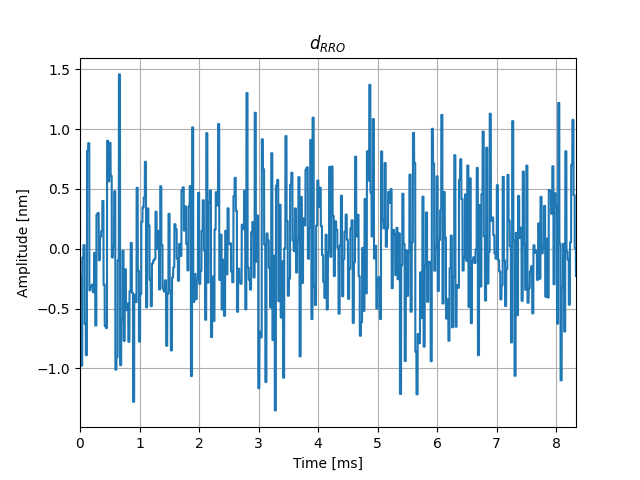
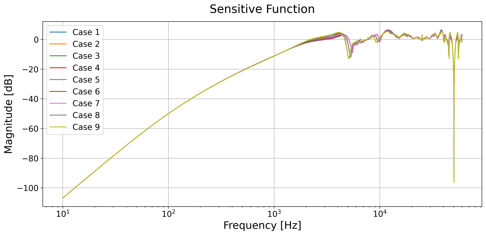
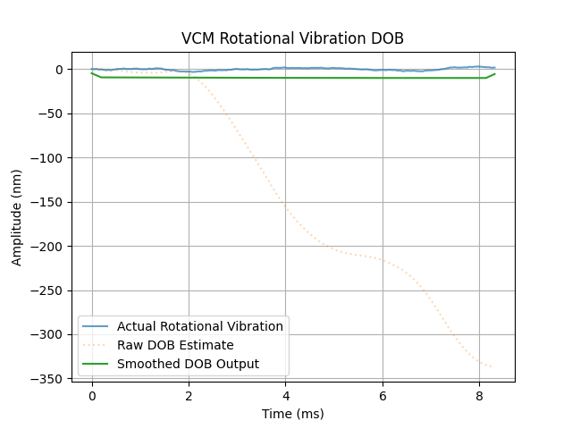
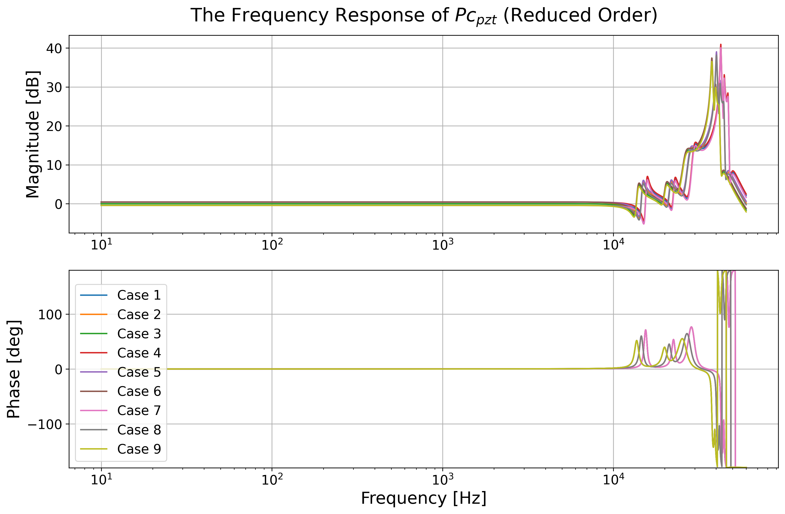
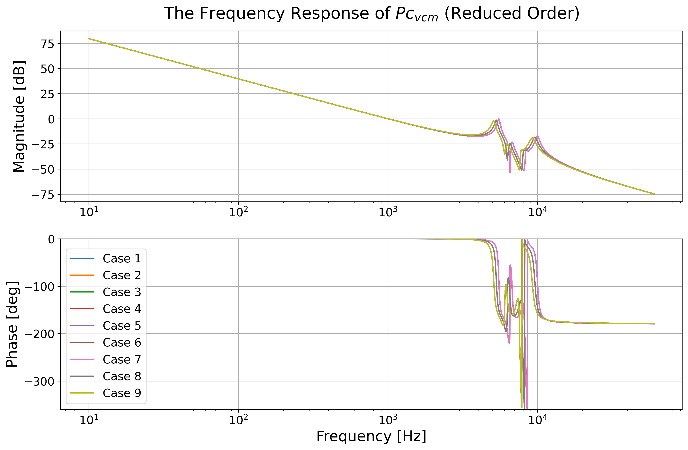

# A Python-Based Framework for Magnetic-Head Positioning Control Systems in Hard Disk Drives

This project serves as a Python adaptation of the Hard Disk Drive Servo Control Benchmark: "Magnetic-head Positioning Control System in HDDs," authored by Takenori Atsumi in MATLAB under the Investigating R&D Committee on “Precision Servo Technology for High Value-Added Mechatronic System,” The Institute of Electrical Engineers of Japan.  The Matlab source material can be found on the MATLAB Central File Exchange, uploaded in 2024, and is available through the following link: [Magnetic-head Positioning Control System in HDDs](https://www.mathworks.com/matlabcentral/fileexchange/111515-magnetic-head-positioning-control-system-in-hdds).

The adaptation is inspired by and based on the research and methodologies outlined in the reference paper by T. Atsumi and S. Yabui, titled "Quadruple-Stage Actuator System for Magnetic-Head Positioning System in HDDs." This paper was published in The IEEE Transactions on Industrial Electronics, Volume 67, Issue 11, on pages 9184-9194, in November 2020. The DOI for this paper is: 10.1109/TIE.2019.2955432 and is supported by the Investigating R&D Committee on “Precision Servo Technology for High Value-Added Mechatronic System”, The Institute of Electrical Engineers of Japan.


## Repository Structure 

    .
    ├── Data_RRO.txt
    ├── Fre_Resp.json
    ├── README.md
    ├── __pycache__
    │   ├── Function_simulation.cpython-311.pyc
    │   ├── Tools.cpython-310.pyc
    │   ├── data_fm.cpython-311.pyc
    │   ├── demo.cpython-311.pyc
    │   ├── plant.cpython-310.pyc
    │   ├── tools.cpython-311.pyc
    │   └── utils.cpython-310.pyc
    ├── demo
    │   └── README.md
    ├── function_simulation.py
    ├── license.txt
    ├── plant.py
    ├── plot_control_system.py
    ├── DOB_of_VCM.py
    ├── plot_result
    │   ├── ... Figures
    ├── reduce_order_compare.py
    ├── reduced_order_system.py
    ├── plot_result_ReducedOrder
    │   ├── ... Figures
    │ 
    ├── requirements.txt
    ├── simulate_trackfollow.py
    └── utils.py

#### Data Files:
- `Data_RRO.txt`: Stores Repeatable Run-Out (RRO) data for function simulation.
- `Fre_Resp.json`: Contains frequency response data.

#### Python Scripts:
- `function_simulation.py`: Executes HDD simulations based on scenarios defined in `plant.py` and saves the outputs to a designated folder. This process may be time-consuming.
- `plant.py`: Specifies the dynamics of the plant being simulated.
- `utils.py`: Includes additional data definitions and utility functions supporting the simulations.
- `plot_control_system.py`: Visualizes the frequency responses of the control system.
- `DOB_of_VCM.py` designs a disturbance observer (DOB) for the VCM.
- `reduce_order_compare.py` includes utility functions supporting the reduced order function of the plant. 
- `reduce_order_system.py` visualizes the frequency responses of the reduced-order system while comparing them with the 
- `simulate_trackfollow.py`: Displays simulation outcomes, requiring prior generation of simulation result files.

#### Plot Results:
- The `plot_result` folder houses various figures illustrating the frequency response and other analytical results of the simulations, such as amplitude spectra and Bode plots.
- The `plot_result_ReducedOrder` folder houses various figures illustrating the frequency responses of the reduced-order system while comparing them with the original control system.

#### Documentation and Other Files:
- `README.md`: Provides an overview and instructions for utilizing the repository.
- `license.txt`: Contains the licensing information.
- `requirements.txt`: Lists the Python package dependencies needed to run the simulations and analyses.

#### Cache and Miscellaneous:
- An additional `README.md` file may be found in the `demo` subdirectory, which explains the parameters, additional data files and system use cases.

# HDD Benchmark Problem Simulation and Analysis

The organization and content of this repository are inspired by a Matlab reference structure, designed to enhance the navigability and understanding of Hard Disk Drive (HDD) benchmark problem simulations and their analyses.

## Installation and Environment Setup

### Environment Requirements
This project is compatible with Python 3.11.0 and was tested with specific package versions:

- numpy 1.23.4
- control 0.9.4
- scipy 1.11.3
- matplotlib 3.7.0

### Setting Up the Environment

Follow these steps to prepare the environment for running the simulations and analyses:

1. **Clone the repository:**
   - Download the code package and extract its contents.
      ```bash
      https://github.com/macs-lab/PyHDDBenchmark.git
      cd PyHDDBenchmark
      ```

2. **Install Dependencies:**
   - Use pip to install the necessary Python packages:
     ```bash
     pip install -r requirements.txt
     ```

## Running the Project

To engage with the project's simulation and plotting functionalities, execute the appropriate scripts as follows, depending on your objectives:

- **For Plotting Simulation Results:**
  - Prior execution of the controller simulation is required. Run the following command:
    ```bash
    python function_simulation.py
    ```
    Please note that the simulation's execution time may vary depending on your hardware specifications. It could take several minutes to complete.
    Once the simulation has finished running, you can proceed with plotting the results.

  - To visualize frequency responses, execute:
    ```bash
    python plot_control_system.py
    ```
    or disturbance observer
    ```bash
    python plot_control_system_with_DOB.py
    ``` 

  - To compare the frequency responses between the reduced-order plants and the original plants of PZT actuator and VCM, execute:
    ```bash
    python reduce_order_system.py
    ```

  - For simulating the controller and visualizing the results, use the command:
    ```bash
    python simulate_trackfollow.py
    ```

## Simulation Output Directory

Note: All the code execution results, including plots and data files, will be saved in the **`plot_result`** subdirectory and the **`plot_result_ReducedOrder`** subdirectoryby default. If you wish to change the output directory, you can modify the corresponding setting in the `utils.py` file.

## Key Features

1. **Multi-resonance high-precision actuator models:**
   - Detailed Voice Coil Motor (VCM) and Piezoelectric (PZT) actuator models
      <br />
      <div align="center">
      
      </div>
      <div align="center">
      
      </div>
   - Captures multiple resonance modes for accurate system representation

   - Efficient time- and frequency- domain analysis
      <center class="half">
       
      </center>
   
   - Based on [Horowitz et al. (2007)](https://doi.org/10.1016/j.conengprac.2006.09.003)

2. **Rich disturbance modeling:**
   - Repeatable Run-Out (RRO): Oscillation of target tracks on the disk
      <br />
      <div align="center">
      
      </div>
   - Rotational Vibration (RV): External vibration from other HDDs
      <br />
      <div align="center">
      
      </div>
   - Fan-induced Vibration: Vibration caused by cooling fans
      <br />
      <div align="center">
      
      </div>
   - Disturbance models based on [Guo and Zhang (2003)](https://doi.org/10.1109/TMAG.2003.814287)

3. **Decoupled sensitivity loop shaping:**
   - Implements the decoupled sensitivity design approach
      <br />
      <div align="center">
      
      </div>  
   - Allows separate controller design for VCM and PZT stages
   - Based on [Li and Horowitz (2001)](https://doi.org/10.1109/3516.928724)

4. **Disturbance Observer (DOB) design:**
   - Functionality for designing and implementing disturbance observers
      <br />
      <div align="center">
      
      </div> 
   - Specialized DOB implementation for rotational vibration (df) in VCM
   - Design features:
     - Low-pass filter (10Hz cutoff) to target rotational disturbance frequencies
     - Moving average smoothing for robust estimation
     - Conservative compensation scale (0.01) for stability
   - Performance results:
     - 29.19% reduction in RMS error
     - 35.40% reduction in maximum error
     <div align="center">
     
     </div>
   - Inspired by [Wu et al. (2003)](https://doi.org/10.1109/TIE.2003.819658)

5. **Temperature and gain variation modeling:**
   - Nine pre-configured cases for different operational conditions
   - Temperature variations: Low, Room, and High temperatures
   - PZT actuator gain variations: Nominal, +5%, and -5%
   - Based on [Atsumi et al. (2019)](https://doi.org/10.1109/TIE.2019.2955432)
      | Case No. |    1    |    2    |    3    |     4      |     5      |     6      |     7      |     8      |     9      |
      | :------: | :-----: | :-----: | :-----: | :--------: | :--------: | :--------: | :--------: | :--------: | :--------: |
      |  Temp.   |   LT    |   RT    |   HT    |     LT     |     RT     |     HT     |     LT     |     RT     |     HT     |
      | PZT gain | Nominal | Nominal | Nominal | Nominal+5% | Nominal+5% | Nominal+5% | Nominal-5% | Nominal-5% | Nominal-5% |

6. **Reduced-order modeling:**
   - Tools for creating and analyzing reduced-order system models
      <br />
      <div align="center">
      
      </div>
      <div align="center">
      
      </div> 
   - Useful for control design and system analysis
   - Inspired by [Boettcher et al. (2010)](https://doi.org/10.1299/jamdsm.4.107)
## Contact

For questions or feedback, please contact chx@uw.edu